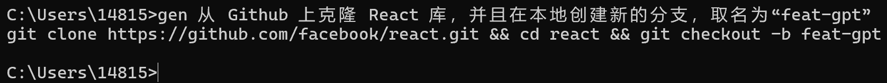
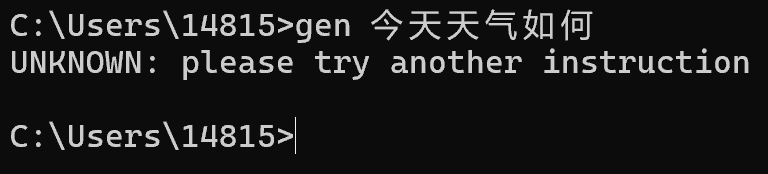
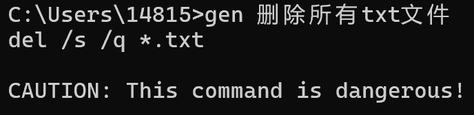
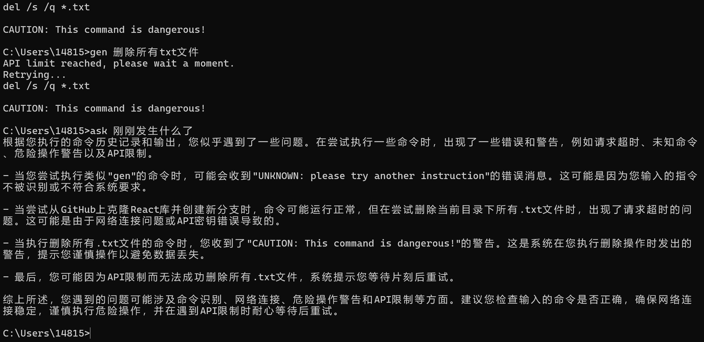
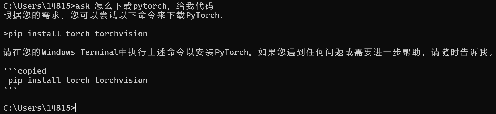

# AI-CMD: Integrate GPT with Windows Terminal

**AI-CMD** is an innovative project designed to seamlessly integrate GPT capabilities with the Windows terminal, enabling users to directly `ask questions` and `generate command-line code` using natural language. By leveraging an OpenAI proxy, AI-CMD offers accessibility `without the need for a VPN`, simplifying the process of tackling terminal-related queries and automating command generation.

---
## Getting Started

### Installation
1. Clone the project from GitHub:
   ```
   git clone https://github.com/rhouselyn/ai-cmd
   ```
2. Navigate to the project directory and install the required packages:
   ```
   cd ai-cmd
   pip install -r requirements.txt
   ```
3. run the setup:
    ```
    python setup.py
    ```
4. Add the project directory to your system's PATH environment variable (or copy the dictionary in output of setup.py):
   - As for how to find the PATH environment variable, refer to [this](https://support.esri.com/zh-cn/knowledge-base/edit-an-environment-variable-1462478594981-000002146)

### Configuration
- In `config.py`, input your `api_key`.
- You can specify your preferred model and language settings for a tailored experience.
---
## Usage & Feature

### 1. Generating Commands
- :running: Typing `gen` followed by a directive in the terminal prompts GPT to translate it into a command, which is then copied to the clipboard automatically.
- :couple_with_heart: Connect multiple row operations using && or &
  > 

- :pig: If GPT is unsure about the task, it responds with
  > UNKNOWN: please try another instruction.
  

- :sparkler: For potentially hazardous operations, it adds a cautionary note:
  > CAUTION: This command is dangerous!
  
  
### 2. Asking Questions
- :boot: Use `ask` followed by your question in the terminal. AI-CMD will automatically fetch the context from the terminal, process the inquiry with GPT, and generate a response.
   > 
- :hamburger: You don't need to worry about consuming too much tocken, it will only intercept instructions from back to front until it exceeds 1000 words.
- :airplane: Because of Windows don't provide any api for aproach to acquire history output in current dialog, a brief screen flash indicates the use of a virtual keyboard for copying and processing, ensuring the clipboard's content is promptly cleared afterwards.
- :stuck_out_tongue_closed_eyes: If the response contains terminal commands, they are automatically extracted and copied to the clipboard so that you can paste directly to the terminal.
   > 
   
### error handling
- :o: If the api speed limit is reached, the program automatically retries until it is lifted。
- :red_circle: Run time more than 15 seconds automatically exit the program
  
---
## Credits
- :heart: This project draws inspiration from the [cli-gpt](https://github.com/MagicCube/cli-gpt?tab=readme-ov-file) project, adopting its approach to prompt design for effective and intuitive user interactions. 
- :two_hearts: The document is mainly written by chatGPT4.

### Please Enjoy a smoother, more interactive terminal experience with AI-CMD!
